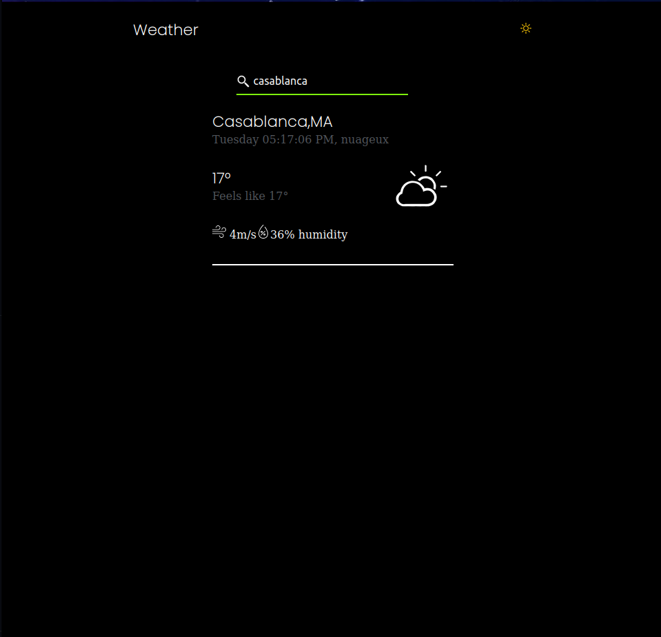
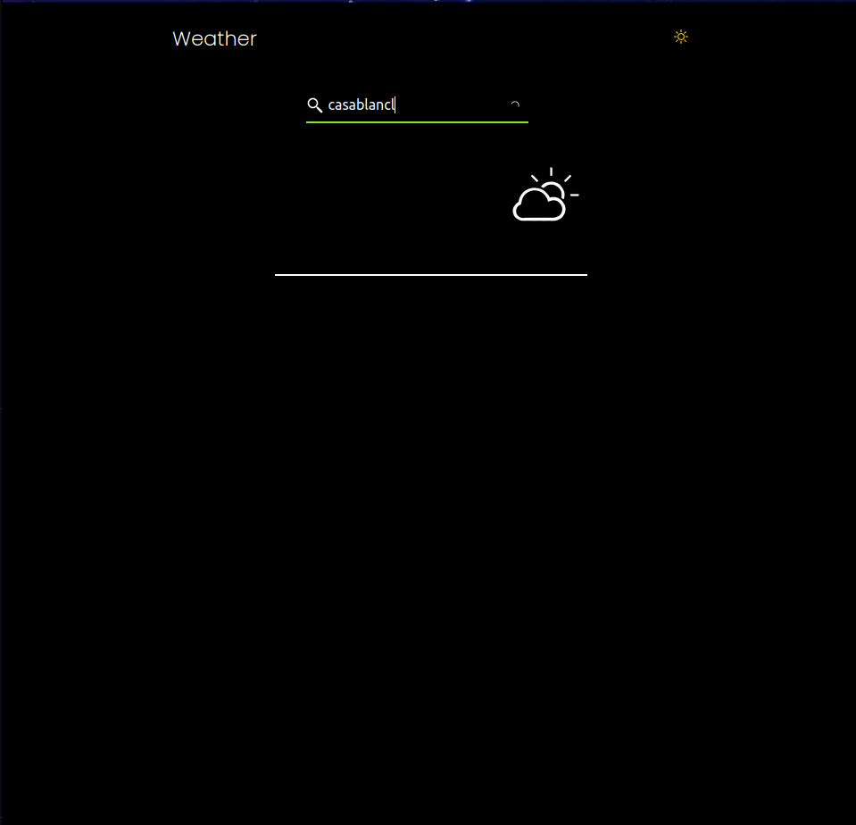
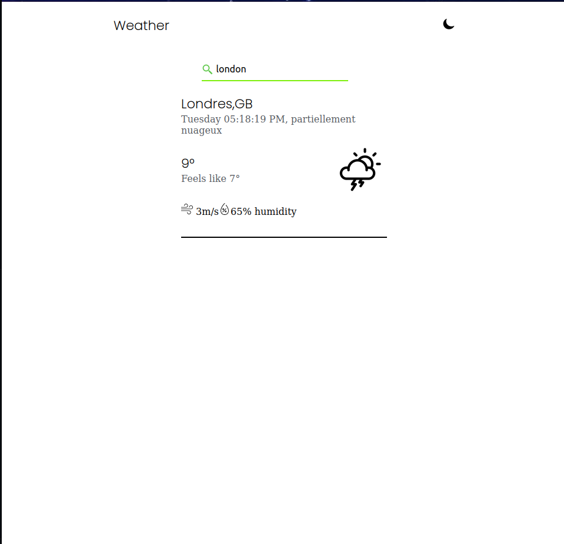
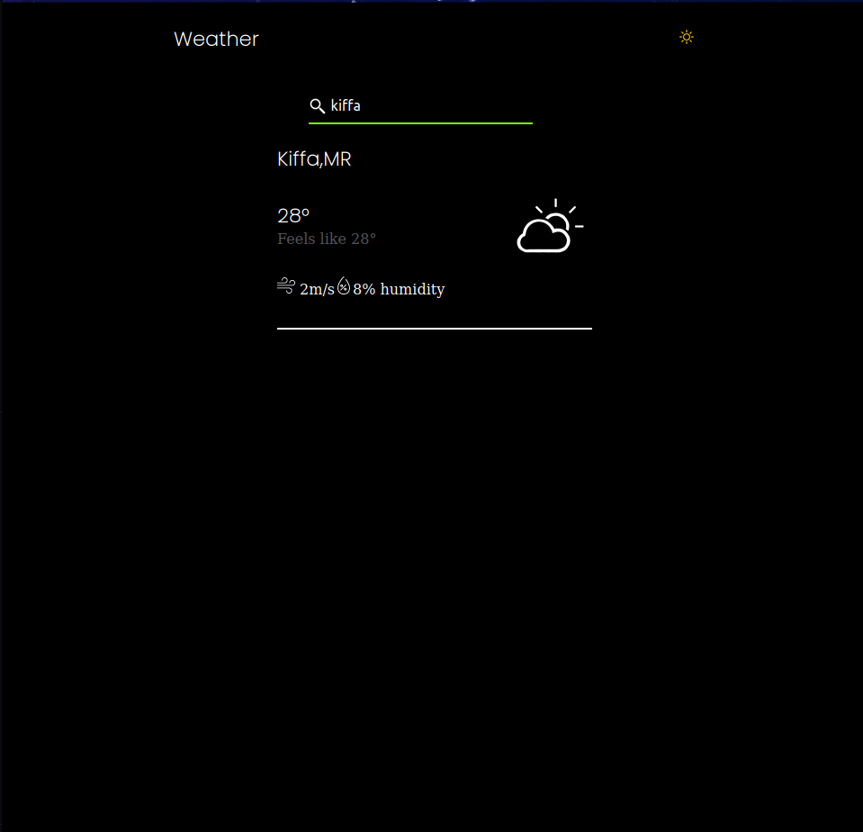

# React weather checker
<h4> A Progressive web Weather Application Built with React <h4>
<h4>This Weather Application takes a Query of the city Name and Returns the Information </h4>

  
Dark Mode

    
    
  

  

  
Light Mode

    

    
    
  

=======

>>>>>>> d1eb4cd47fdbe8ca19a5bb04e7f59c3267e552c2
