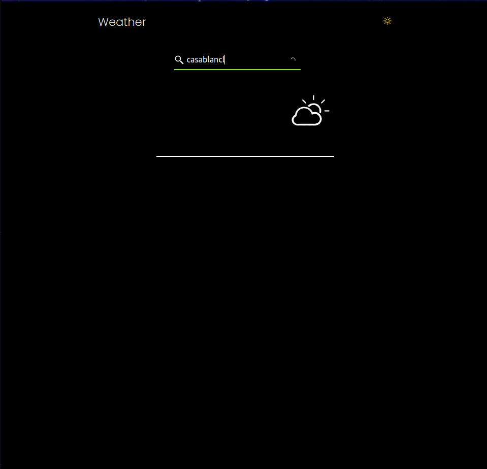

# React weather checker
<h4> A Progressive web Weather Application Built with React <h4>
<h4>This Weather Application takes a Query of the city Name and Returns the Information </h4>

  

  <h2 display="flex">Dark Mode</h2>
    
    
   

<table>
  <tr>
    <td valign="top"></td>
    <td valign="top"></td>
  </tr>
</table>

  

  
Light Mode

    

    
    
  
